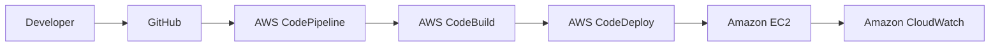

# AWS CI/CD Pipeline Automation

An end-to-end CI/CD project that automatically validates, packages, and deploys a versioned web application from GitHub to Amazon EC2.

**Project author:** ARRA SHIVA RAM TEJA

## Target architecture



## Pipeline stages

1. **Source** - A push to the configured GitHub branch starts the pipeline.
2. **Build and test** - CodeBuild runs `tests/validate.sh` and prepares the deployment artifact.
3. **Deploy** - CodeDeploy copies the application to EC2 and runs the lifecycle scripts.
4. **Validate** - The deployment succeeds only when the local health check returns `healthy`.

## Repository structure

```text
.
├── app/                  # Versioned web application
├── scripts/              # CodeDeploy lifecycle scripts
├── tests/                # CI validation checks
├── docs/                 # Project notes and deployment guide
├── screenshots/          # Final AWS console evidence
├── appspec.yml           # CodeDeploy deployment definition
├── buildspec.yml         # CodeBuild build definition
└── README.md
```

## Local validation

```bash
bash tests/validate.sh
```

## Current status

- [x] Starter application created
- [x] Automated validation test created
- [x] CodeBuild specification created
- [x] CodeDeploy specification and hooks created
- [x] GitHub repository created
- [ ] EC2 deployment target configured
- [ ] CodeDeploy manual deployment validated
- [ ] CodeBuild project configured
- [ ] CodePipeline connected to GitHub
- [ ] End-to-end deployment validated

## AWS Region

Asia Pacific (Hyderabad), `ap-south-2`.

## AWS services

- Amazon EC2 - Nginx application server
- AWS CodePipeline - CI/CD orchestration
- AWS CodeBuild - build and validation stage
- AWS CodeDeploy - deployment lifecycle automation
- Amazon S3 - pipeline artifact storage
- AWS IAM - service roles and EC2 instance permissions
- Amazon CloudWatch - build, deployment, and application visibility
- GitHub - source-code repository

## Cost awareness

AWS resources can incur charges depending on the account, region, resource type, and runtime. Resources created for the lab will be validated, documented, and cleaned up when they are no longer required.

## Resume description

**AWS CI/CD Pipeline Automation** - Built an automated CI/CD pipeline using AWS CodePipeline, CodeBuild, and CodeDeploy to validate application changes and deploy them to Amazon EC2. Integrated GitHub as the source repository and implemented deployment lifecycle hooks for installation, startup, and service health validation.
