# AWS CI/CD Pipeline Automation

An end-to-end CI/CD project that automatically validates, packages, and deploys a versioned web application from GitHub to Amazon EC2.

**Project author:** ARRA SHIVA RAM TEJA

## Target architecture

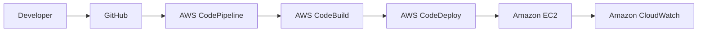

## Pipeline stages

1. **Source** - A push to the configured GitHub branch starts the pipeline.
2. **Build and test** - CodeBuild runs `tests/validate.sh` and prepares the deployment artifact.
3. **Deploy** - CodeDeploy copies the application to EC2 and runs the lifecycle scripts.
4. **Validate** - The deployment succeeds only when the local health check returns `healthy`.

## Repository structure

```text
.
├── app/                  # Versioned web application
├── scripts/              # CodeDeploy lifecycle scripts
├── tests/                # CI validation checks
├── docs/                 # Project notes and deployment guide
├── screenshots/          # Final AWS console evidence
├── appspec.yml           # CodeDeploy deployment definition
├── buildspec.yml         # CodeBuild build definition
└── README.md
```

## Local validation

```bash
bash tests/validate.sh
```

## Current status

- [x] Starter application created
- [x] Automated validation test created
- [x] CodeBuild specification created
- [x] CodeDeploy specification and hooks created
- [x] GitHub repository created
- [x] EC2 deployment target configured
- [x] CodeDeploy manual deployment validated
- [x] CodeBuild project configured
- [x] CodePipeline connected to GitHub
- [x] End-to-end deployment validated

## Visual project walkthrough

The screenshots below document the completed project from source control to the
running Version 1.1 application.

### 1. Project overview

The deployed page summarizes the automated path from GitHub through CodeBuild
and CodeDeploy to Amazon EC2.

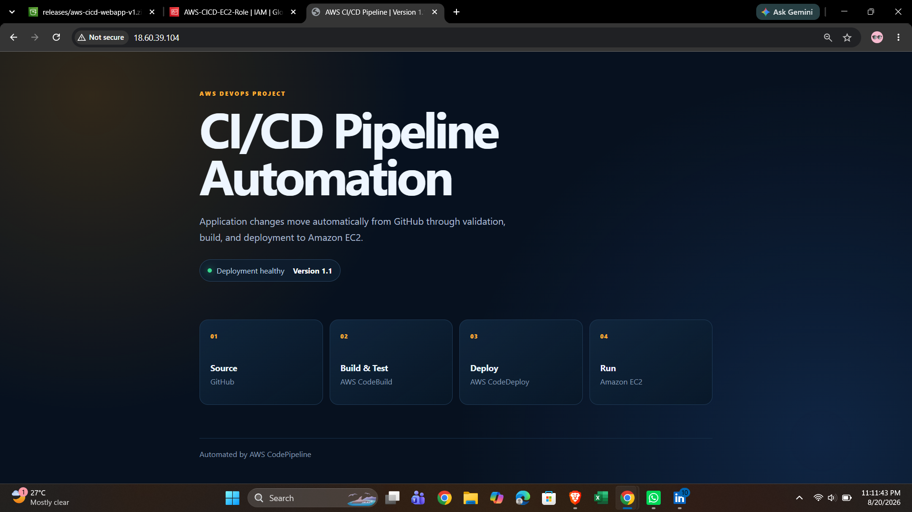

### 2. Public GitHub repository

The repository contains the application, validation test, deployment scripts,
AWS build and deployment specifications, and project documentation.

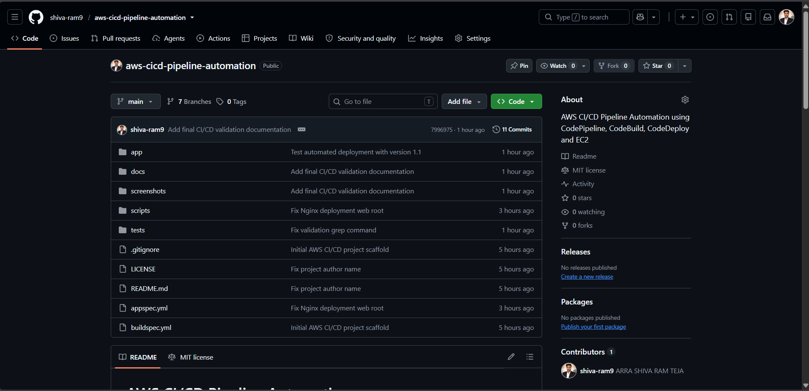

### 3. Version 1.1 source commits

The commit history records the application update and the fixes made while
validating the automated pipeline.

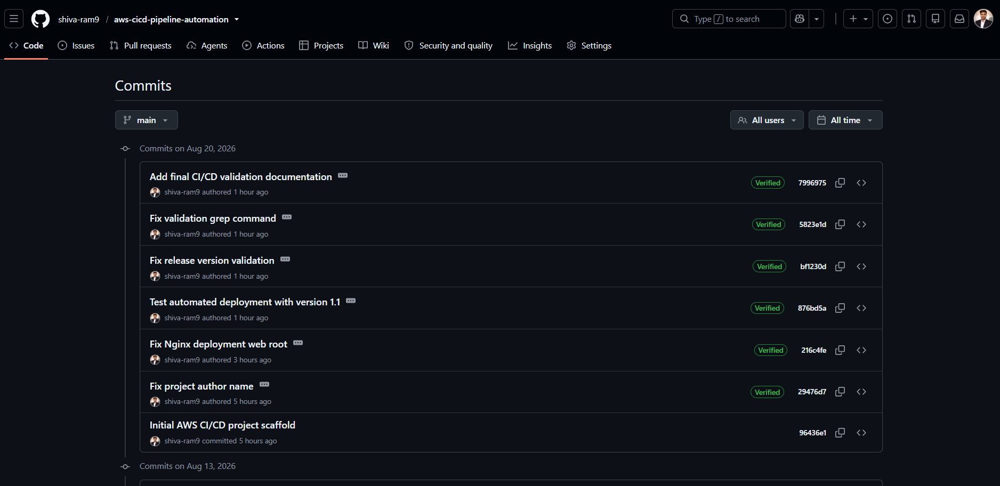

### 4. EC2 deployment target

The Amazon Linux EC2 instance is running with the project IAM role and the tags
used by the CodeDeploy deployment group.

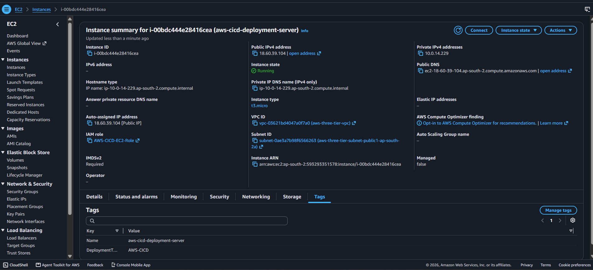

### 5. EC2 IAM permissions

The EC2 role grants Systems Manager access and read access to the deployment
artifacts required by CodeDeploy.

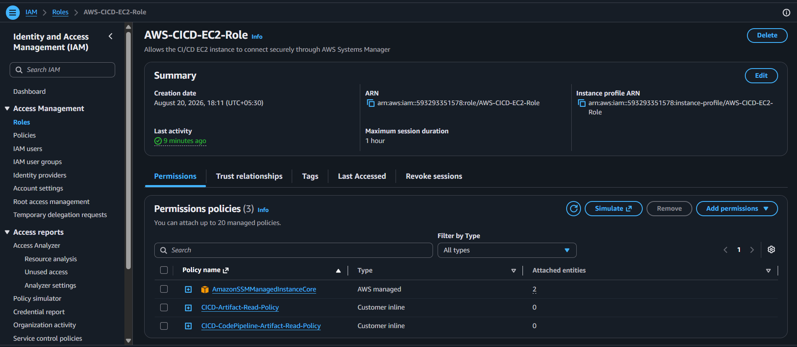

### 6. CodeDeploy application and deployment group

The CodeDeploy application targets the configured EC2 deployment group, whose
latest deployment is successful.

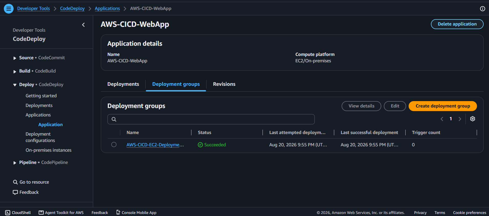

### 7. Successful CodeDeploy deployment

CodeDeploy reports that the application revision was installed successfully on
the EC2 instance.

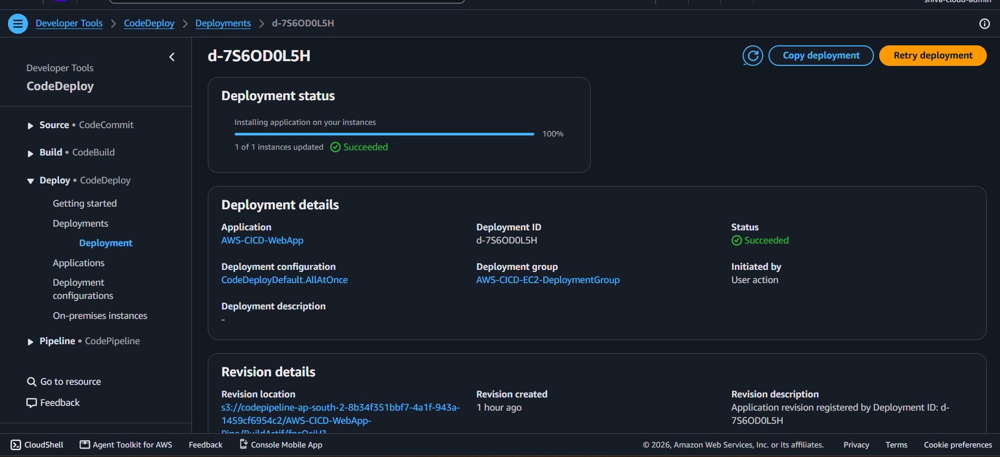

### 8. Successful CodeDeploy lifecycle hooks

Every lifecycle event succeeded, including `DownloadBundle`, `BeforeInstall`,
`ApplicationStart`, and the final `ValidateService` health check.

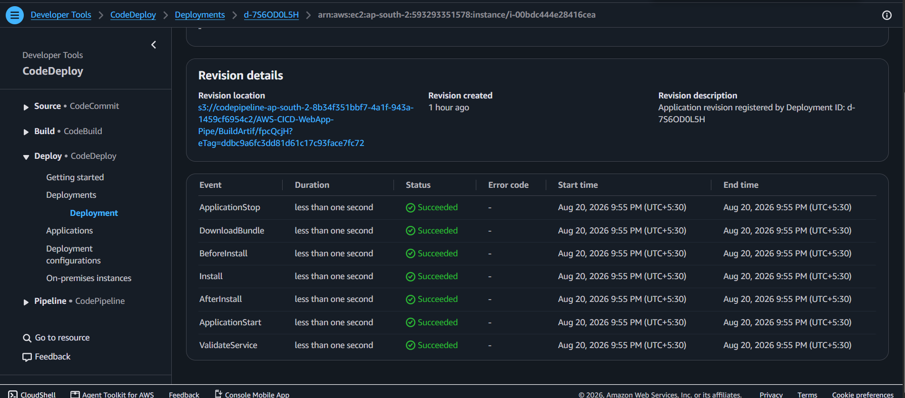

### 9. Successful CodeBuild validation

CodeBuild completed the repository validation and produced the artifact passed
to the deployment stage.

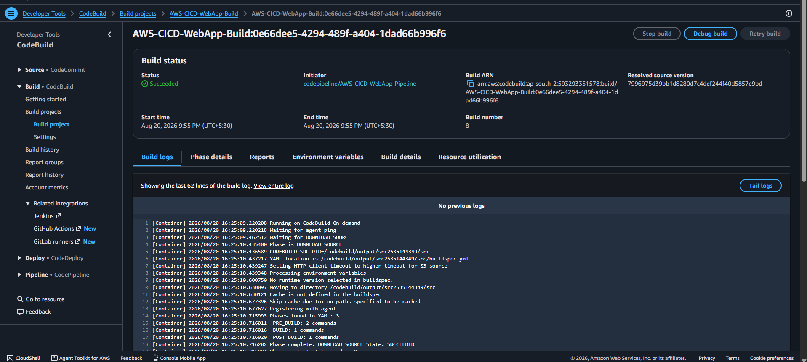

### 10. Successful end-to-end pipeline

The final CodePipeline execution shows green Source, Build, and Deploy stages
for the same revision.

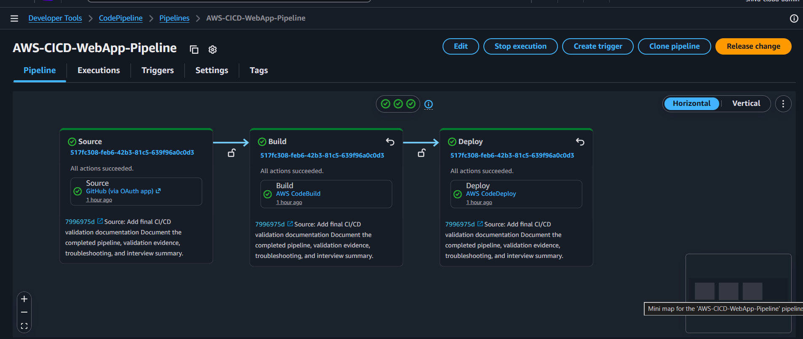

### 11. Version 1.1 running on EC2

The public application displays Version 1.1, confirming that the GitHub change
reached the EC2 web server.

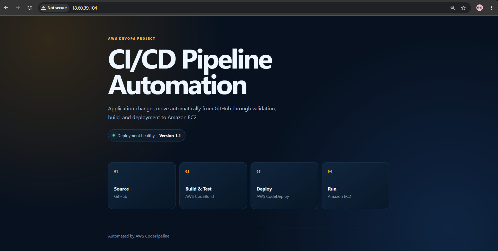

### 12. Application health check

The `/health.html` endpoint returns `healthy`, which is the condition checked by
the deployment validation script.

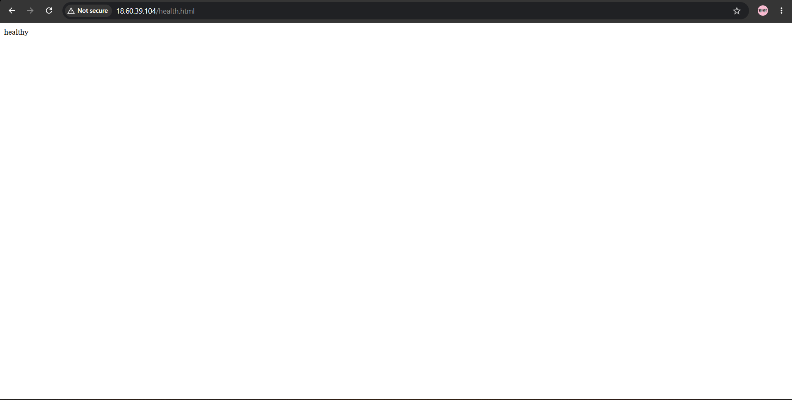

## AWS Region

Asia Pacific (Hyderabad), `ap-south-2`.

## AWS services

- Amazon EC2 - Nginx application server
- AWS CodePipeline - CI/CD orchestration
- AWS CodeBuild - build and validation stage
- AWS CodeDeploy - deployment lifecycle automation
- Amazon S3 - pipeline artifact storage
- AWS IAM - service roles and EC2 instance permissions
- Amazon CloudWatch - build, deployment, and application visibility
- GitHub - source-code repository

## Cost awareness

AWS resources can incur charges depending on the account, region, resource type, and runtime. Resources created for the lab will be validated, documented, and cleaned up when they are no longer required.

## Resume description

**AWS CI/CD Pipeline Automation** - Built an automated CI/CD pipeline using AWS CodePipeline, CodeBuild, and CodeDeploy to validate application changes and deploy them to Amazon EC2. Integrated GitHub as the source repository and implemented deployment lifecycle hooks for installation, startup, and service health validation.
